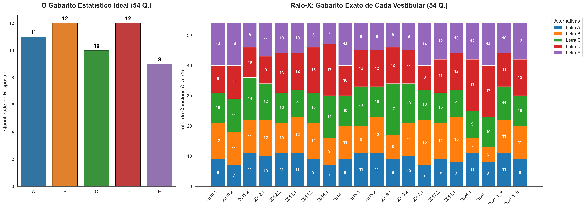

# 📊 Engenharia Reversa de Gabaritos: Análise Estatística e Preditiva do Vestibular FATEC


## 📌 Executive Summary
A distribuição de respostas em exames de larga escala não ocorre de forma puramente aleatória. Bancas examinadoras utilizam algoritmos de balanceamento para mitigar fraudes e penalizar técnicas de resolução baseadas em probabilidade cega (o popular "chute"). 

Este projeto de **Data Analytics & Predictive Modeling** executa uma engenharia reversa no histórico de gabaritos do Vestibular da FATEC (2007 a 2026). Através de extração, limpeza (ETL) e análise estatística de múltiplas safras de provas, o objetivo foi decodificar a "Assimetria Controlada" da banca, segmentando o comportamento por volume de questões e projetando cenários preditivos para edições futuras.

## 🛠️ Arquitetura de Dados e Pipeline (ETL)
Os dados brutos foram extraídos de documentos PDF oficiais, normalizados em formato estruturado (DataFrames) e divididos em três *cohorts* (grupos de controle) com base nas mudanças históricas do formato do exame:

1. **Cohort Legacy (48 Questões):** Edições de 2007 a 2009.
2. **Cohort Standard (54 Questões):** Edições de 2010 a 2025. (O *Core* do Dataset).
3. **Cohort Expansion (60 Questões):** Edições a partir de 2026.

## 📈 Dashboard Analítico: O Padrão Ouro (54 Questões)



## 🔬 Deep Dive Estatístico: Comportamento por Alternativa
Focando no Cohort Standard (A Moda Estatística de 54 questões), a EDA (*Exploratory Data Analysis*) revelou que cada alternativa possui uma "personalidade" ou peso algorítmico específico na arquitetura da prova:

* **Letra A (Baseline Constante):** Atua como o "ruído branco" da prova. Apresenta a menor variância histórica, estacionando consistentemente na faixa de 9 a 11 respostas. Raramente apresenta picos (*outliers* positivos) ou vales (*outliers* negativos).
* **Letra B (Falsa Segurança e Punição Ativa):** Durante mais de uma década, foi a alternativa mais populosa (11 a 12 pontos). Contudo, os dados provam uma intervenção algorítmica recente da banca: nos ciclos 2024.1 e 2024.2, a B sofreu um *crash* severo, caindo para apenas 5 respostas. Isso indica uma política punitiva ativa contra candidatos com vícios de preenchimento.
* **Letra C (A Âncora Estatística):** É o centro de gravidade do modelo. Independente da volatilidade do exame, a Letra C demonstra a maior resiliência do *dataset*, cravando exatas 10 ocorrências na maioria absoluta das edições.
* **Letra D (O Gatilho de Volatilidade):** É a variável de caos inserida para quebrar o balanceamento matemático. Quando a banca adota uma postura agressiva, ela despeja um volume massivo de respostas na letra D, registrando os maiores picos de todo o histórico (15 a 17 ocorrências).
* **Letra E (O Pêndulo de Compensação):** Funciona como variável de ajuste. Apresenta comportamento estritamente binário: para fechar a conta das 54 questões após os picos da Letra D, a Letra E entra em extrema escassez (7-8) ou inunda o gabarito (14 respostas) caso as outras opções estejam abaixo da média.

## 🔄 Análise de Cohorts: A Evolução da Banca
A análise longitudinal cruzada entre os diferentes tamanhos de prova revela a maturação dos algoritmos da banca ao longo das décadas:

* **Fase 1: O Modelo Uniforme (48 Questões | 2007 - 2009)**
  A banca aplicava uma distribuição quase perfeitamente simétrica. Analisando as edições 2007.2 e 2008.1, nota-se uma alocação plana (ex: A=10, B=10, C=10, D=9, E=9). O risco de previsibilidade aqui era altíssimo.
* **Fase 2: A Assimetria Controlada (54 Questões | 2010 - 2025)**
  Para combater a previsibilidade da Fase 1, a banca aumentou o volume da prova e introduziu os conceitos de "Volatilidade" (Letra D) e "Punição" (Letra B). O gabarito deixou de ser *flat* (plano) e passou a ter vales e picos intencionais.
* **Fase 3: A Nova Matriz (60 Questões | 2026.1 - Atual)**
  Com o aumento para 60 questões (Edição 2026.1: A=13, B=11, C=11, D=11, E=14), nota-se que as letras centrais (B, C, D) se estabilizaram fortemente em 11 ocorrências cada, enquanto os extremos (A e E) absorveram a carga extra de questões. 

## 🔮 Forecasting: Cenários Preditivos
Com base na regressão histórica, um modelo de otimização de decisão para o candidato (frente ao risco de tempo esgotado) deve considerar três cenários de montagem do gabarito futuro:

1. **Cenário Conservador (Regressão à Média):** A banca busca o equilíbrio clássico. Probabilidade de 20% cravada por alternativa. Estratégia de preenchimento cego deve focar nas "Âncoras" (C e D) devido à estabilidade de longo prazo.
2. **Cenário Punitivo (Alta Variância):** A banca ataca ativamente o comportamento previsível (padrão visto em 2024). Neste cenário hipotético, uma letra sofrerá escassez severa (ex: B caindo para 5), enquanto uma letra secundária receberá um pico (ex: D indo a 17). 
3. **Cenário de Extremos (Padrão 60 Questões):** Assumindo a solidificação do novo modelo de 60 questões, as alternativas de ponta (A e E) assumem o protagonismo probabilístico, concentrando até 45% do gabarito juntas, tornando-se o vetor mais seguro de mitigação de risco em caso de chute residual.

## 🚀 Como reproduzir este projeto (Deploy Local)
1. Clone este repositório:
   ```bash
   git clone [https://github.com/caiiobuenoo/fatec-analise-gabaritos.git](https://github.com/caiiobuenoo/fatec-analise-gabaritos.git)
